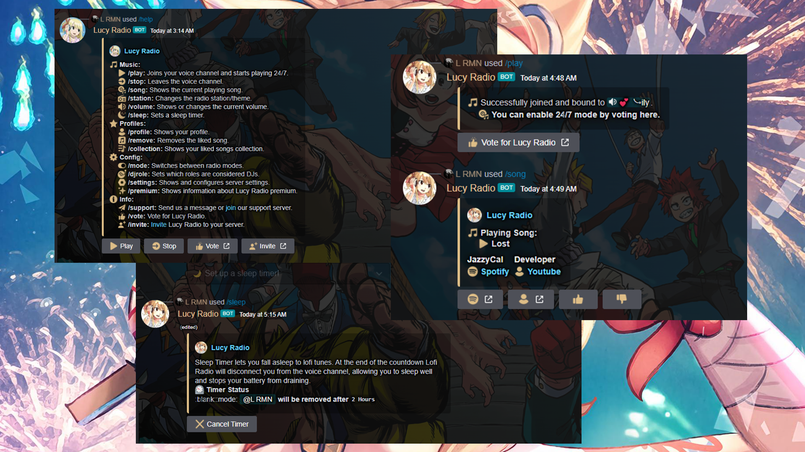

<center></center>


<!-- PROJECT LOGO -->
<br />
<p align="center">
  <a href="https://github.com/lrmn7/Lucy-Radio">
    
  </a>

  <h3 align="center">Lofi Radio</h3>

  <p align="center">
    It is a discord music bot which can play lo-fi song 24/7 &  more functions of lucy radio bot
    <br />
    <br />
    <a href="https://github.com/lrmn7/Lucy-Radio/issues">Report Bug</a>
    ·
    <a href="https://github.com/lrmn7/Lucy-Radio/issues">Request Feature</a>
  </p>
</p>
<!-- ABOUT THE PROJECT -->


## 🌟 Functions
-  Radio Mode
-  24/7 VC 
-  Music Collection
-  Dj Roles
-  Slash Command
-  Stations
-  Profile Card
-  Sleep Timer

<br>

## 🎛️ Requirement
-  Nodejs v16+
-  Java v13 (for lavalink server)
-  yarn  `npm i -g yarn `

<br>

## ⚙️ Installation 
Fill all requirement in `src/config.js` or `.env`

• [yarn](https://yarnpkg.com/)

For install all dependencies use
```
yarn
```
To start your bot 
```
yarn start
```
**OR DO THIS INSTEAD**

• [Npm](https://www.npmjs.com/)

For install all dependencies use
```
npm install
```
To start your bot 
```
node src/index.js 
```

For replit: Open Hidden Files => Goto `replit.nix` and copy these and paste in that file 

[](https://repl.it/github/lrmn7/Lucy-Radio)

  ```
  { pkgs }: {
	deps = [
    pkgs.libuuid
		pkgs.nodejs-18_x
    pkgs.nodePackages.typescript-language-server
    pkgs.yarn
    pkgs.replitPackages.jest
	];
  env = { LD_LIBRARY_PATH = pkgs.lib.makeLibraryPath [pkgs.libuuid];  };
}
```

- You can download all the emoji of this bot from [Here](./emote/) (Changing Emoji will be little complex for you)

###
If you liked this repository, feel free to leave a star ⭐ to help promote !

<br>

## 🖼️ Screenshots
<br />
<p align="center">
  <a href="https://github.com/lrmn7/Lucy-Radio">
    
  </a>
</p>

<br>

# Note
This bot base on the Lucy-Radio(verified) discord bot which is in nearby 850k server & this is not official code of that bot. Also, you don't have permission to make public bot using this code!. The logo, emojis & colors are all copied from Lofi Radio Discord Bot. <3

- [Original Bot Invite Link](https://discord.com/api/oauth2/authorize?client_id=830530156048285716&permissions=66407488&scope=applications.commands%20bot)

<br>

# 💌 Support Server 
- [Error? Join US](https://discord.gg/WFfjrQxnfH)

<br>

# Custom Discord Bot

 If you want bot more advance than this then you can order!

- [Fiverr](https://www.fiverr.com/lrmn7)
